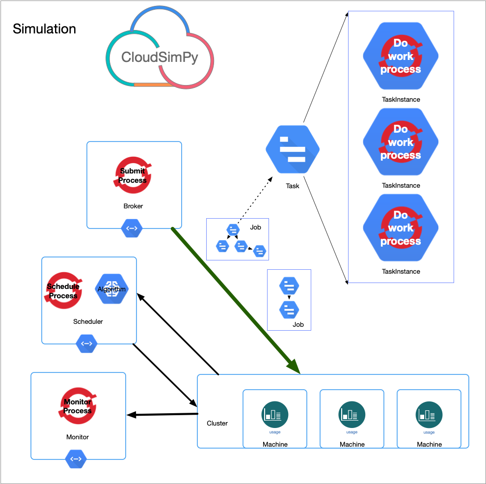
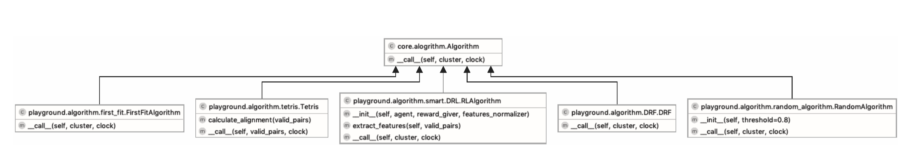

# CloudSimPy 数据中心作业调度仿真框架

*CloudSimPy* 基于离散事件仿真框架 [SimPy](https://simpy.readthedocs.io/en/latest/contents.html)，利用 *Python* 语言进行实现；
*Python* 语言的科学计算、深度学习、机器学习生态相较于其他编程语言更加完善，*CloudSimPy* 可以与具有 *Python* 支持的深度学习框架（比如 *TensoFlow*，*PyTorch*）很好的结合，有助于研究基于机器学习或者深度学习的资源管理方法。
在 `CloudSimPy/playground/algorithms/smart/DRL.py` 中的基于深度强化学习的数据中心作业调度算法由 *TensorFlow* 进行实现，并在其 *eager* 模式下进行推断和训练。

## CloudSimPy
作为数据中心作业调度仿真框架 *CloudSimPy* 包含两个 *Python* 包 `core` 和 `playground`。
#### Core
`core` 对数据中心作业调度问题中的各个实体（*entity*）进行了抽象和建模，`core` 包中含有以下模块：

+ `config` 中 `TaskInstanceConfig`、`TaskConfig`、`JobConfig` 分别给出任务实例、任务、作业的配置（资源需求，持续时间等）
+ `job` 中 `TaskInstance`、`Task`、`Job` 分别是对于任务实例、任务、作业的建模
+ `machine` 是对机器的建模
+ `cluster` 是对于计算集群的建模，类 `Cluster` 维护着集群的机器列表
+ `alogrithm` 中定义了调度算法的接口，用户自定义的调度算法必须实现这一接口，是实现**策略模式**的关键
+ `scheduler` 是对于调度器的建模，通过策略模式这一设计模式，不同的 `Scheduler` 实例可以使用不同的调度算法进行调度
+ `broker` 实现了类 `Broker`，`Broker` 代替用户对计算集群提交作业
+ `monitor` 实现了类 `Monitor`，`Monitor` 用于在仿真过程中对仿真的状态进行监测和记录
+ `simulation` 是对一次仿真的建模，一次仿真必须构造一个集群 `Cluster` 实例；构造一系列作业配置 `JobConfig` 实例，利用这些作业配置实例构造一个 `Broker` 实例；
构造一个调度器 `Scheduler` 实例。在一次仿真可以选择开是否使用一个 `Monitor` 实例进行仿真过程的监测

#### Playground
`playground` 包设计用于方便软件包用户进行试验，主要包含 `algorithm` 包，`utils` 包。
其中 `algorithm` 包中预先实现了一下作业调度算法：

+ Random 调度算法，包含在 `random_alogorithm` 模块中
+ First-fit 调度算法，包含在 `first-fit` 模块中
+ Tetris 调度算法， 包含在 `tetris` 模块中
+ DRF 调度算法，包含在 `DRF` 模块中
+ 基于深度强化学习的数据中心作业调度算法，包含在 `smart` 包中
    + agent 智能体，实现了强化学习中的*策略梯度*
    + brain *TensorFlow* 实现的神经网络结构
    + DRL 基于深度强化学习的数据中心作业调度算法
    + reward_giver 强化学习奖励函数

`utils` 包中含有以下模块：
+ `csv_reader` 中的 `CSVReader` 类从 CSV 文件中读取作业配置并生成作业配置列表
+ `episode` 中的 `Episode` 类用于 **episodic** 方式的仿真实验
+ `feature_functions` 提供了在训练强化学习模型时，用于特征提取和特征归一化的函数
+ `tools` 中的 `multiprocessing_run` 用于**多进程模式**的训练；`average_slowdown` 和 `average_completion` 用于从一个 `Episode` 类的对象中抽取计算统计信息

## 高性能仿真
由于在数据中心中任务实例 `TaskInstance` 是实际的资源消耗者也是实际业务逻辑的执行者，因此在概念上将 `core` 包 `job` 模块中的 `TaskInstance` 设计为一个 *SimPy* 中的进程（`Process`），
而类 `Task` 设计为 `TaskInstance` 的集合，类 `Job` 设计为 `Task` 的集合。`Job`，`Task` 的运行状态利用 *Python* 下的 `property` 特性实现，
并采用如下图所示的信息传递机制实现 `Task`，`Job` 状态的合成。

当我们询问一个 `Job` 的状态是，`Job` 实例会询问它的 `Task` 实例们的状态，`Task` 实例则会去询问它们各自的 `TaskInstance` 实例们的状态，
`Task` 实例根据各自的 `TaskInstance` 实例们的状态合成自己的状态，然后 `Job` 实例根据它的 `Task` 实例们的状态合成自己的状态，即状态信息反向传播最终回到 `Job` 实例。
这样的设计不仅可以保证 `Job` 和 `Task` 状态信息的准确性和一致性，更重要的是没有在每个仿真时间步主动维护 `Job` 和 `Task` 的状态信息，
而是将 `Job` 和 `Task` 状态的获得推迟到 `Job` 和 `Task` 状态的被动询问时，这允许我们在关闭监测功能（也就是不询问 `Job` 和 `Task` 的状态）时让仿真快速高效的进行。
被动询问取代主动维护，实现了仿真过程中 **hotpath** 的优化，让 **hotpath** 上的执行的操作尽可能的少尽可能的快。

除了 `TaskInstance` 在概念上设计为一个 *SimPy* 进程，`Broker`、`Scheduler`、`Monitor` 也被设计为 *SimPy* 进程。
`Broker` 进程不断地按照作业的提交时间将作业配置列表所描述的作业提交至集群 `Cluster` 实例，直至所有的作业提交完毕，`Broker` 停止提交并销毁。
`Scheduler` 按照调度时间步不断地进行调度，直到仿真 `Simulation` 被标记为结束（当 `Broker` 被销毁（即不会有新的作业到达）且所有已提交的作业都执行完毕时，
`Simulation` 被标记为结束）。`Monitor` 按照监测时间步不断地进行仿真状态的监测和记录，直到仿真 `Simulation` 被标记为结束。

另外的数据中心作业调度问题中的实体 `Simulation`，`Cluster`，`Machine`，`Task`，`Job` 就是普通的类的概念，仅仅作为相关信息的管理器。

## 策略模式
策略模式是一种行为设计模式，在策略模式中定义一系列算法，将每个算法放入一个单独的类中，并使这些类的对象可相互互换。
在策略模式中，我们有一个类，它可以以不同方式执行特定操作，比如此处的调度器 `Scheduker` 类它可以以不同的调度算法（调度策略）执行调度，我们可以将所有这些算法提取到一个个称为策略的单独的类中。原始类（称为上下文）持有一个对策略的引用，并将工作委托给该策略，而不是自己去直接执行工作。原始类不负责选择适当的算法，相反，用户将所需的策略传递给它。事实上，原始类对策略知之甚少，它通过相同的通用的接口调用所有的策略。
这样，上下文就变得独立于具体策略，我们可以添加新算法或修改现有算法，而无需更改原始类或其他策略的代码。

通过使用策略设计模式，在 *CloudSimPy* 中将 `Scheduler` 的实现和 `Scheduler` 所使用的调度算法的实现独立开来，
并分别放在了 `core` 包中和 `playground/algorithm` 包中，策略模式的类图如下图所示。

在`playground/algorithms/smart/reward_giver.py` 中也使用了策略模式为具有不同优化目标的基于深度强化学习的作业调度模型提供不同的奖励计算方法：
+ MakespanRewardGiver 给出用于优化完工时间（Makespan）的奖励
+ AverageSlowDownRewardGiver 给出用于优化平均 SlowDown 的奖励 
+ AverageCompletionRewardGiver 给出用于优化平均完成时间的奖励
